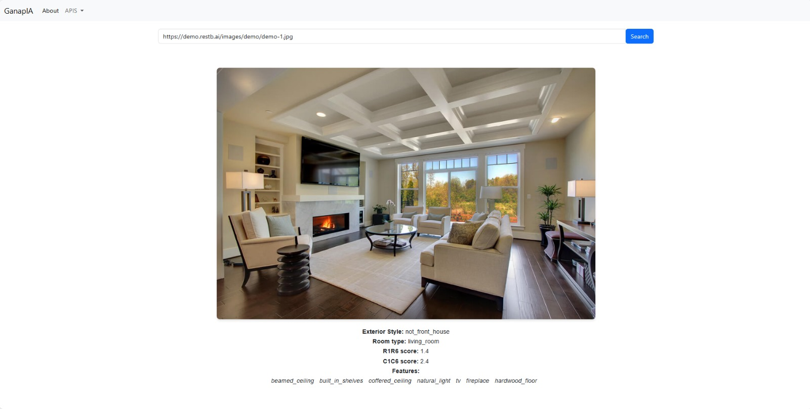
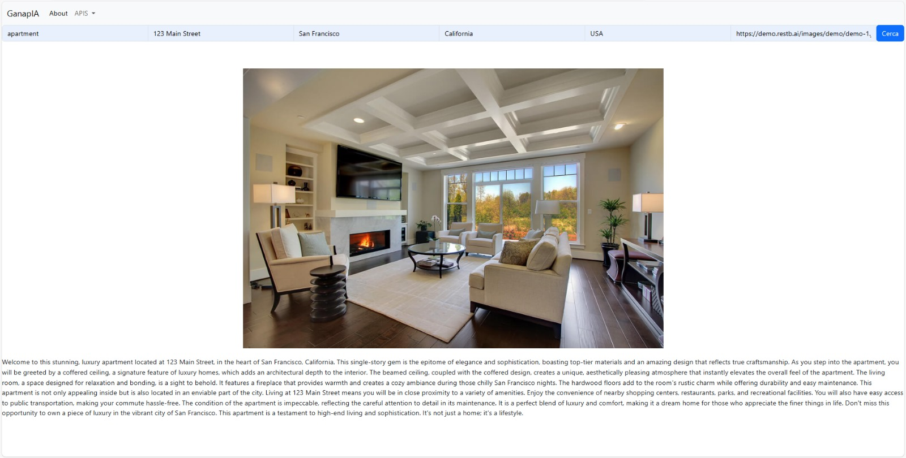
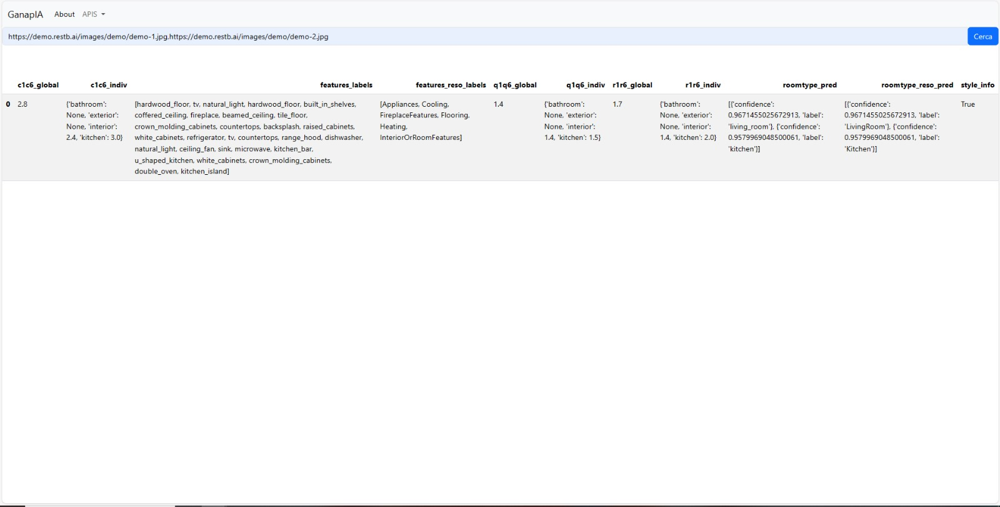
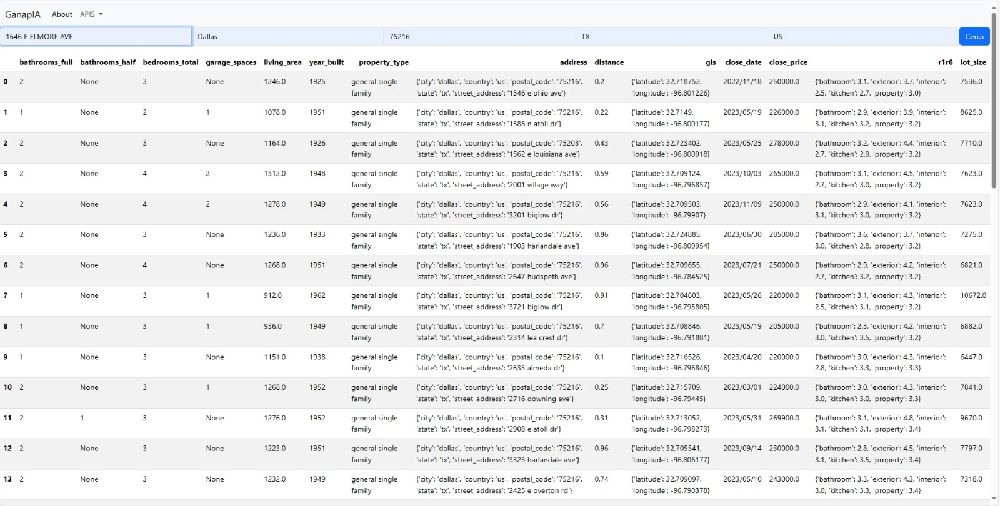

# Web application for Restb.ai API

## How to deploy:
1. Install the needed dependencies:
    * `pip install django`
    * `pip install pandas`
    * `pip install requests`

2. Instatiate the Django server using the following command:
    * `python3 manage.py runserver`

3. Access the web application through http://127.0.0.1:8000

## API Usage:

1. VisionAPI:

2. DescriptionAPI:

3. PropertyAPI:

4. VisionAPI:

## Data processing

Contains the processing of the data obtained from different requests done to the Restb.ia APIs to improve the data showability, and the usage for posterior purposes as can be doing predictions or enginieering new columns from the obtained ones.

Some predictions have been done to exemplify the usage of the processed data and some of the code has been used on the web to show the data obtained from the requests.

## Experimentation

With the before mentioned data and a predictor model like the Random Forest regressor, we have tried to explain to which elements of the images the algorithms behind the APIs gave the most importance related to the score, so we could try and see if it was possible to improve the score in a cheap an easy way. However the RFR feature extraction didn't give us satisfactory results, it can be because the RFR lacks the visual information the API gets and also a lack of rows in the dataset. So we could not extract any information to continue with the experiment we planed. However we still tried with an specific kind of labels, the ones related to floors, to see if we could see something diferent, still, it wasn't the case and we couldn't work with the obtained results.
